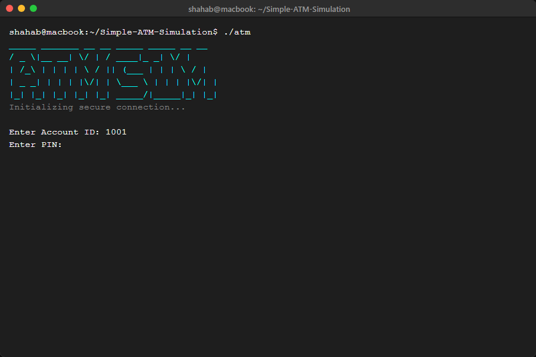
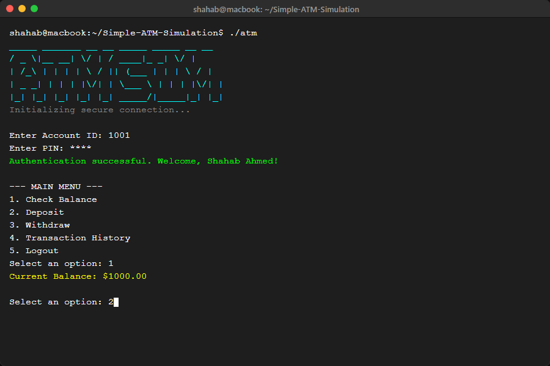
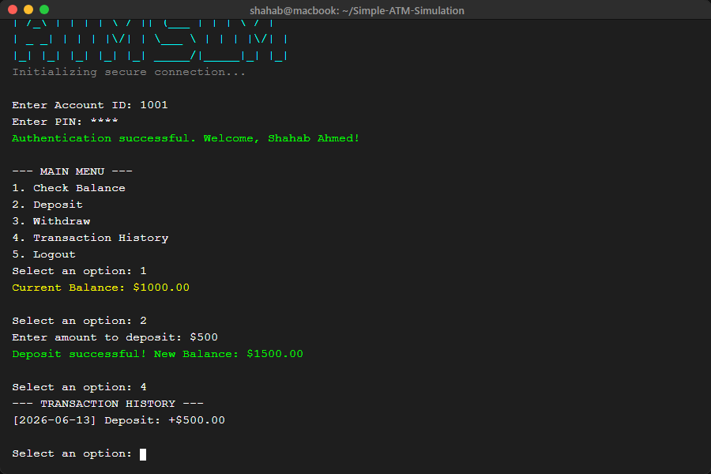
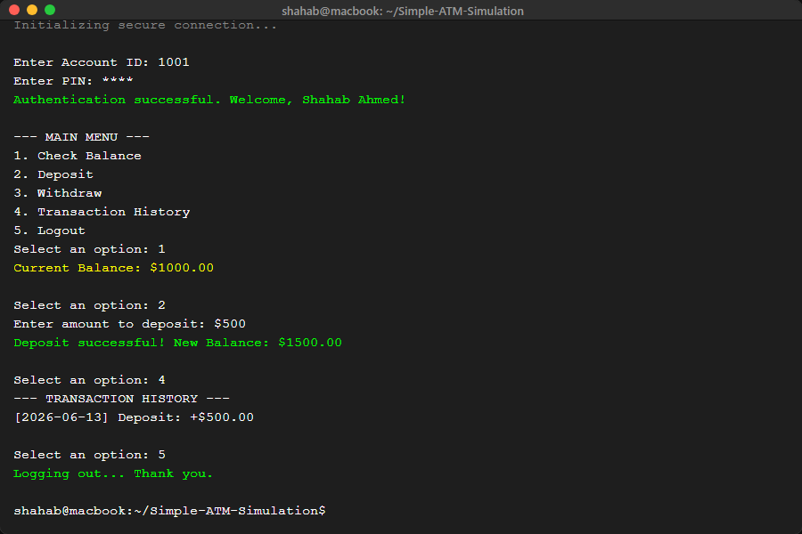

# Simple ATM Simulation

**Terminal-based ATM simulator in C++** demonstrating object-oriented design: accounts, PIN authentication, transactions, and an ANSI-colored console UI.

<p align="center">
  
  
  
</p>

---

## Overview

A single-file C++ console application that models a small bank ATM. Users authenticate with account ID and PIN, then deposit, withdraw, check balance, or view history. An admin mode supports adding and removing accounts. The UI uses ANSI colors and a short animated splash screen.

## Screenshots

<p align="center">
  
  
</p>
<p align="center">
  
  
</p>

## Features

- PIN authentication with **3-attempt lockout**
- **Deposit**, **withdraw**, and **balance inquiry**
- **Per-account transaction history**
- **Multiple customer accounts** plus admin access
- **Admin panel** — create and delete accounts
- **ANSI color UI** with animated startup banner

## Quick start

**Compile and run** (from the repository root):

```bash
g++ -std=c++17 -o atm "Atm Simulation.cpp" && ./atm
```

**Windows (PowerShell / CMD):**

```powershell
g++ -std=c++17 -o atm.exe "Atm Simulation.cpp"
.\atm.exe
```

> Use **Windows Terminal** or a modern terminal for full ANSI color support.

## Demo credentials

| Account      | ID   | PIN    |
|-------------|------|--------|
| Shahab Ahmed | 1001 | `1234` |
| Sara Khan    | 1002 | `4321` |
| Ali Hassan   | 1003 | `0000` |
| Admin        | —    | `9999` |

## What this project demonstrates

- **Encapsulation** — account data and operations behind classes
- **Separation of concerns** — UI flow vs. banking logic
- **STL usage** — containers and strings for account storage
- **User input validation** — PIN attempts and menu-driven control flow

## Project structure

```
Simple-ATM-Simulation/
├── Atm Simulation.cpp   # Application source
└── README.md
```

## Author

**Shahab Ahmed** — [GitHub](https://github.com/ShahabAhmed01) · [LinkedIn](https://www.linkedin.com/in/shahabahmed01/) · [Portfolio](https://shahabahmed01.github.io)

## License

Open source for learning and portfolio use.
